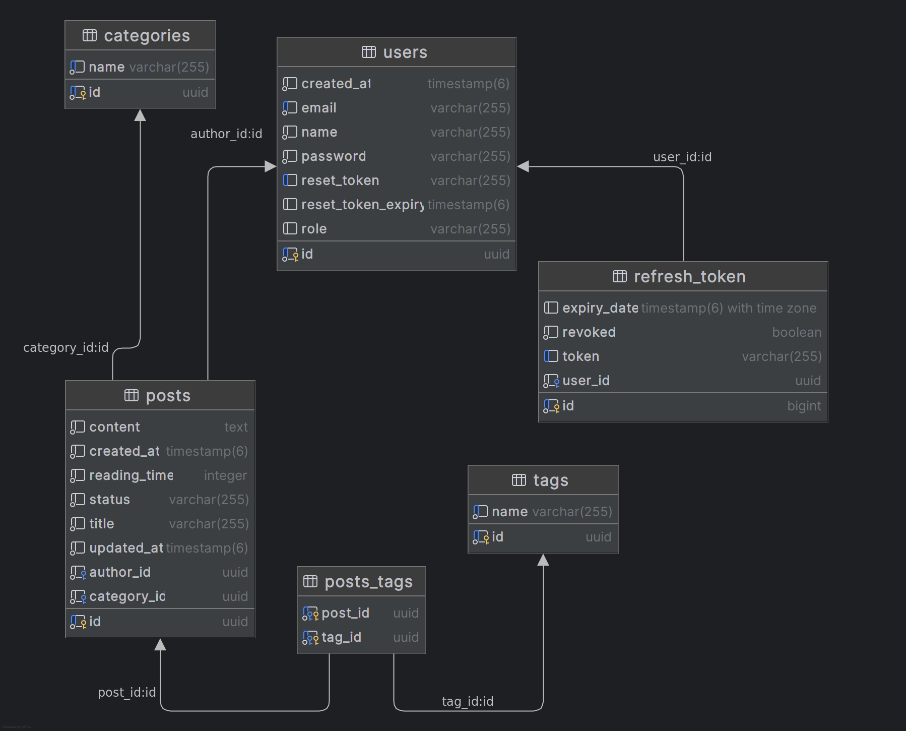

# Minimal Blog API

A RESTful API built with Spring Boot and Java, demonstrating core backend development skills. This project provides a secure, role-based content management system for a blog application.

## Key Features

* **Authentication & Authorization:** Secure JWT-based authentication with refresh tokens and role-based access control (Admin, Editor, User).
* **Content Management:** Full CRUD operations for posts, categories, and tags, supporting draft/published workflows.
* **Email Service:** Implemented for password reset and author notifications for reviewed posts.
* **API Documentation:** Interactive API documentation available via Swagger UI.
* **Database Management:** PostgreSQL integration for structured data storage.

## Technologies

* **Backend:** Spring Boot 3.4.5, Java 21, Spring Security 6
* **Database:** PostgreSQL, Hibernate/JPA
* **Security:** JWT (JJWT), BCrypt
* **API Tools:** OpenAPI 3 / Swagger UI, MapStruct
* **Deployment:** Docker, Maven
## Project Structure

* `controllers`: Defines RESTful endpoints.
* `domain`: Contains DTOs and entities.
* `services`: Implements business logic.
* `repositories`: Manages database operations.
* `security`: Handles JWT and password reset logic.
* `config`: Handles configuration for OpenAPI and Spring Security.
 
## Database Schema

The application uses PostgreSQL database schema designed for content management and user authentication. Key entities include:

* **Users**: Manages user profiles and roles.
* **Posts**: Stores blog content with metadata, linked to authors and categories.
* **Categories & Tags**: Provide flexible content organization.
* **Refresh Tokens**: Securely handles user session management.



## API Endpoints

### Authentication
```
POST   /api/v1/auth/register              # User registration
POST   /api/v1/auth/register-editor       # Editor registration (Admin only)
POST   /api/v1/auth/login                 # User authentication
POST   /api/v1/auth/logout                # Secure logout with token cleanup
POST   /api/v1/auth/refresh-token         # Token refresh rotation
POST   /api/v1/auth/forgot-password       # Password reset request
POST   /api/v1/auth/reset-password        # Password reset confirmation
```

### Posts Management
```
GET    /api/v1/posts                      # List published posts (paginated)
GET    /api/v1/posts/drafts               # List user's draft posts
POST   /api/v1/posts                      # Create new post
GET    /api/v1/posts/{id}                 # Get specific post details
PUT    /api/v1/posts/{id}                 # Update existing post
DELETE /api/v1/posts/{id}                 # Delete post (soft delete)
PATCH  /api/v1/posts/{id}/publish         # Publish draft post
PATCH  /api/v1/posts/{id}/unpublish       # Convert to draft
```

### Categories Management
```
GET    /api/v1/categories                 # List all categories with post counts
POST   /api/v1/categories                 # Create new category (Admin/Editor)
GET    /api/v1/categories/{id}            # Get category details
PUT    /api/v1/categories/{id}            # Update category (Admin/Editor)
DELETE /api/v1/categories/{id}            # Delete category (Admin only)
GET    /api/v1/categories/{id}/posts      # Posts by specific category
```

### Tags Management
```
GET    /api/v1/tags                       # List all tags with usage counts
POST   /api/v1/tags                       # Create new tag
GET    /api/v1/tags/{id}                  # Get tag details
PUT    /api/v1/tags/{id}                  # Update tag information
DELETE /api/v1/tags/{id}                  # Delete tag
GET    /api/v1/tags/{id}/posts            # Posts associated with tag
```

## Getting Started (Local)

1.  **Prerequisites:** Ensure Java 21+, Docker, and Maven are installed.
2.  **Clone Repository:** `git clone https://github.com/2016mehrab/minimal-blog-api.git && cd minimal-blog-api`
3.  **Configuration:** Customize `application.properties` in `src/main/resources/` for local application settings. Refer to `application-example.properties` for guidance.
4.  **Run with Docker Compose:**
    ```bash
    docker compose up --build
    ```
    * **Access Swagger UI:** `http://localhost:8080/swagger-ui.html`
    * **Access Adminer (DB GUI):** `http://localhost:8888`
        * *(Server: `db`, User: `root`, Pass: `secret`, DB: `minimal-blog`)*

## Deployment

* **Backend Hosting:** Railway.app (Free Tier)
* **Database Hosting:** Neon (PostgreSQL, Free Tier)
* **Frontend Hosting:** [Netlify](https://minimal-blog-mehrab.netlify.app/home)

*For more information about the frontend, please visit the main [Minimal Blog Frontend repository](https://github.com/2016mehrab/minimal-blog).*